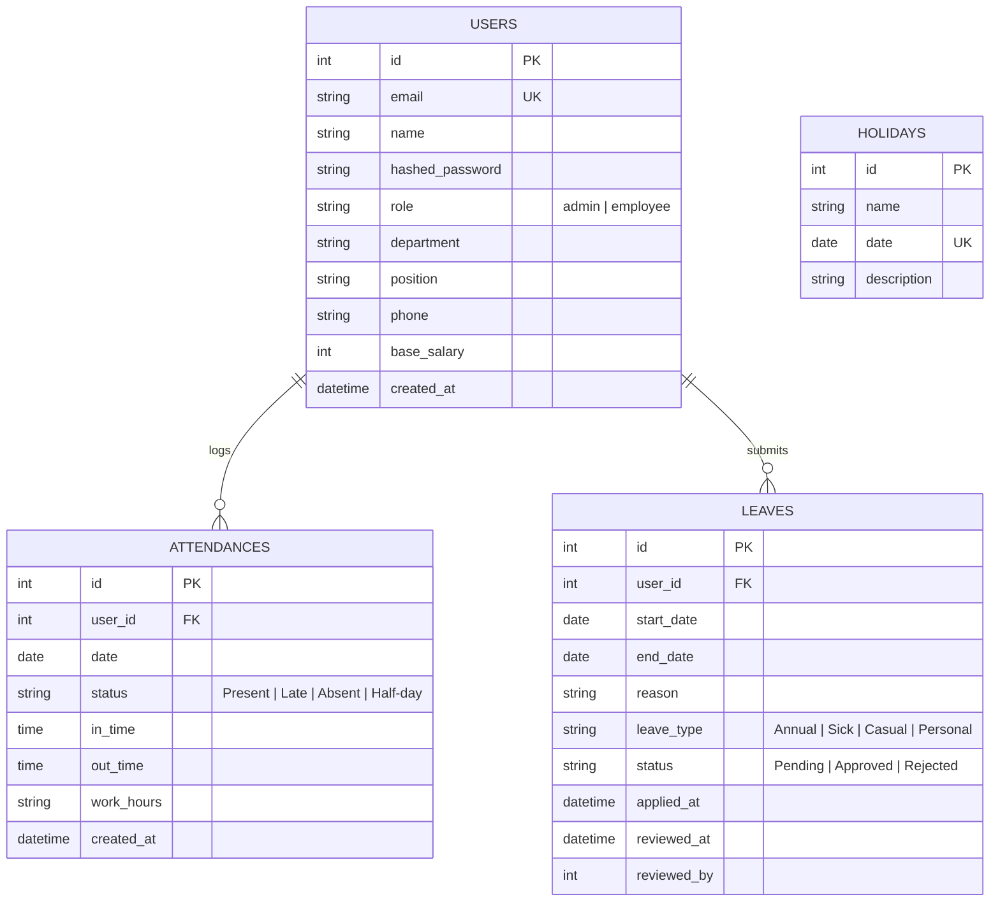

# 🚀 NexusHR — Modern, Logic-First HRMS

[](https://hrms-sigma-brown.vercel.app/)
[](https://fastapi.tiangolo.com)
[](https://react.dev)
[](https://tailwindcss.com)

**NexusHR** is an enterprise-ready, logic-first Human Resource Management System (HRMS) engineered to eliminate common operational headaches like ghost payroll deductions, ambiguous attendance states, and chaotic leave approval workflows.

---

### 🌐 Live Deployment Links
- 🚀 **Live Web Application**: [https://hrms-sigma-brown.vercel.app/](https://hrms-sigma-brown.vercel.app/)
- 📖 **Interactive Swagger API Docs**: [https://hrms-sigma-brown.vercel.app/docs](https://hrms-sigma-brown.vercel.app/docs)
- 📑 **ReDoc Documentation**: [https://hrms-sigma-brown.vercel.app/redoc](https://hrms-sigma-brown.vercel.app/redoc)
- ⚡ **One-Click DB Seeder Endpoint**: [https://hrms-sigma-brown.vercel.app/init-db](https://hrms-sigma-brown.vercel.app/init-db)

## 🌟 Why NexusHR?

Traditional HR software is often plagued by fragile business logic and disconnected spreadsheets. NexusHR was designed from the ground up to solve these core issues:

- 🎯 **Zero-Error Automated Payroll**: Dynamically calculates previous month payroll using actual calendar boundaries, weekend/holiday filtering, and pro-rated daily deductions. Say goodbye to "ghost absences" on future calendar dates.
- 🔐 **State-Machine Attendance**: Guarantees clean attendance data by preventing double check-ins, enforcing shift order (Check-In → Check-Out), and automatically classifying punctuality based on business rules.
- 🏖️ **Conflict-Aware Leave Management**: Built-in validation prevents retroactive leave requests, inverted dates, and overlapping applications.
- 📄 **On-The-Fly PDF Payslip Generation**: Generates pixel-perfect, branded PDF payslips server-side using ReportLab with direct streaming downloads.
- 👥 **Role-Based Access Control (RBAC)**: Distinct dashboards, navigation menus, and permission boundaries for Administrators and Employees.

---

## 🏗️ System Architecture

```
┌─────────────────────────────────────────────────────────────┐
│                       Client Layer                          │
│   React 19  •  TailwindCSS  •  Shadcn UI  •  Recharts       │
└──────────────────────────────┬──────────────────────────────┘
                               │ HTTPS / JSON / JWT Bearer
                               ▼
┌─────────────────────────────────────────────────────────────┐
│                    API & Business Logic                     │
│   FastAPI (Async ASGI)  •  Pydantic v2  •  OAuth2 / Jose    │
└──────────────┬──────────────────────────────┬───────────────┘
               │                              │
               ▼                              ▼
┌──────────────────────────────┐ ┌────────────────────────────┐
│      Data Persistence        │ │      Document Engine       │
│  SQLAlchemy 2.0 ORM          │ │  ReportLab Canvas Engine   │
│  Hybrid Engine:              │ │  Server-side PDF streaming │
│  • SQLite (Local / Dev)      │ └────────────────────────────┘
│  • PostgreSQL (Production)   │
└──────────────────────────────┘
```

---

## 🛠️ Technology Stack

### Frontend
- **Framework**: React 19 (Hooks, Context API, React Router DOM v7)
- **Styling**: TailwindCSS 3.4 & PostCSS
- **Component Primitives**: Radix UI / Shadcn UI components
- **Visual Analytics**: Recharts (Interactive bar charts and KPI metrics)
- **Icons & Alerts**: Lucide React & Sonner (Rich toast notifications)
- **Build Tooling**: CRACO (Create React App Configuration Override)

### Backend
- **Framework**: FastAPI (Python 3.10+)
- **Server**: Uvicorn ASGI Server
- **ORM & Database**: SQLAlchemy 2.0 with hybrid PostgreSQL / SQLite support
- **Authentication**: JWT (JSON Web Tokens) with HS256 algorithm via `python-jose` & `passlib[bcrypt]`
- **Data Validation**: Pydantic v2 with strict type validation & `email-validator`
- **PDF Generation**: ReportLab 4.x for server-side dynamic PDF generation

---

## 📂 Project Structure

```text
HRMS/
├── backend/
│   ├── database.py         # Hybrid DB setup (PostgreSQL / SQLite connection engine)
│   ├── hrms.db             # Local SQLite database instance
│   ├── main.py             # FastAPI entrypoint, API routes, auth & business logic
│   ├── models.py           # SQLAlchemy database models & enum definitions
│   ├── requirements.txt    # Python backend package dependencies
│   ├── seed_data.py        # Comprehensive database seeder with demo accounts
│   └── test_date.py        # Helper utility for payroll date calculations
├── frontend/
│   ├── public/             # Static public assets and HTML template
│   ├── src/
│   │   ├── components/     # Reusable UI components (Sidebar, Header, Radix/Shadcn UI)
│   │   ├── contexts/       # AuthContext (JWT storage, session handling, API wrapper)
│   │   ├── data/           # Mock workforce data and fallback records
│   │   ├── layouts/        # DashboardLayout with responsive role-based sidebar
│   │   ├── pages/          # Application views:
│   │   │   ├── LoginPage.js        # Split-pane JWT login screen
│   │   │   ├── Dashboard.js        # Role-aware dashboard (Employee vs Admin)
│   │   │   ├── Attendance.js       # Live check-in/out & 7-day attendance history
│   │   │   ├── Leaves.js           # Leave request form & personal application history
│   │   │   ├── Payroll.js          # Salary breakdown & instant PDF payslip download
│   │   │   ├── Employees.js        # Admin employee directory with search & filters
│   │   │   └── ApprovalCenter.js   # Admin pending leave approval/rejection panel
│   │   ├── App.js          # Client routes & global toast providers
│   │   └── index.css       # Custom design system tokens & Tailwind imports
│   ├── craco.config.js     # CRACO build & alias configuration
│   ├── package.json        # Frontend dependencies & scripts
│   └── tailwind.config.js  # Tailwind theme colors, gradients, and animation config
├── .gitignore              # Git ignored files & build artifacts
├── README.md               # Project documentation
└── test_result.md          # End-to-end verification and testing logs
```

---

## ⚡ Key Features & Business Logic Rules

### 1. Smart Attendance State Machine
- **Punctuality Rule**: Check-ins on or before **09:30 AM** are marked as `Present`. Check-ins after 09:30 AM are automatically recorded as `Late`.
- **Shift Integrity**: An employee can only check in once per calendar day. Once checked out, the shift for that day is finalized and cannot be re-opened.
- **Duration Tracking**: Automatically calculates total duration upon check-out (e.g., `8h 45m`).

### 2. Conflict-Aware Leave Management
- **Validation Engine**:
  - Start date cannot be in the past.
  - End date must be on or after the start date.
  - Overlap algorithm `(StartA <= EndB) and (EndA >= StartB)` rejects duplicate or conflicting leave spans.
- **Approval Workflow**: Admins review pending leaves from the Approval Center. Approvals/rejections timestamp the review and log the reviewer's ID for audit compliance.

### 3. Zero-Error Payroll & PDF Payslips
- **Boundary Auto-Detection**: Calculates payroll for the *preceding completed month* so that active/future days never trigger false unpaid absences.
- **Working Day Formula**:
  $$\text{Working Days} = \text{Total Calendar Days} - (\text{Saturdays} + \text{Sundays} + \text{Official Holidays})$$
- **Deduction Calculation**: Unpaid absences are pro-rated based on actual month length:
  $$\text{Daily Rate} = \frac{\text{Base Salary}}{\text{Days in Month}}$$
  $$\text{Deductions} = \text{Daily Rate} \times \text{Unpaid Absences}$$
- **Tax & Net Pay**: Applies a 12% standard tax bracket and computes net payable salary:
  $$\text{Net Salary} = \max(0, \text{Base Salary} - \text{Deductions} - \text{Tax})$$
- **Instant Payslip Download**: ReportLab renders a formal payslip table and returns a binary PDF stream (`application/pdf`) directly to the browser.

---

## 🔑 Demo Credentials

The database comes pre-seeded with realistic employee profiles, attendance records, and leave requests:

| Role | Name | Email | Password | Department | Base Salary | Seeded Data |
| :--- | :--- | :--- | :--- | :--- | :--- | :--- |
| 👮‍♂️ **Admin** | Aditya Verma | `admin@hrms.com` | `admin123` | Management | ₹20,00,000 | Full admin access, approvals & stats |
| 👨‍💻 **Employee** | Rahul Sharma | `rahul@hrms.com` | `pass123` | Engineering | ₹12,00,000 | 5-day attendance history (Present/Late) |
| 👩‍💼 **Employee** | Priya Patel | `priya@hrms.com` | `pass123` | Human Resources | ₹9,00,000 | Approved Sick Leave record |
| 👨‍🎓 **Employee** | Amit Kumar | `amit@hrms.com` | `pass123` | Engineering | ₹3,00,000 | Pending Casual Leave request |

---

## 🚀 Quick Start Guide

### Prerequisites
- **Python**: Version 3.10 or higher
- **Node.js**: Version 18.x or higher (with `npm` or `yarn`)
- **Git**: Installed and configured

---

### Step 1: Clone and Set Up Backend

1. Navigate to the backend directory:
   ```bash
   cd backend
   ```

2. Create and activate a Python virtual environment:
   ```bash
   # Windows (PowerShell)
   python -m venv venv
   .\venv\Scripts\Activate.ps1

   # macOS / Linux
   python3 -m venv venv
   source venv/bin/activate
   ```

3. Install backend dependencies:
   ```bash
   pip install -r requirements.txt
   ```

4. Initialize database and seed initial test data:
   ```bash
   python seed_data.py
   ```

5. Launch the FastAPI server:
   ```bash
   uvicorn main:app --reload --port 8000
   ```

> 🌐 **Backend API**: `http://localhost:8000`  
> 📖 **Interactive Swagger UI**: `http://localhost:8000/docs`  
> 📑 **ReDoc Documentation**: `http://localhost:8000/redoc`

---

### Step 2: Set Up and Run Frontend

1. Open a new terminal and navigate to the frontend directory:
   ```bash
   cd frontend
   ```

2. Install Node dependencies:
   ```bash
   npm install
   ```

3. Start the React development server:
   ```bash
   npm start
   ```

> 💻 **Frontend Portal**: `http://localhost:3000`

---

## 📡 Complete REST API Reference

All protected endpoints require the `Authorization: Bearer <access_token>` header.

### 🔐 Authentication & System
| Method | Endpoint | Auth | Description |
| :--- | :--- | :--- | :--- |
| `POST` | `/token` | Public | Authenticate with form credentials (`username`, `password`) and receive JWT token. |
| `GET` | `/init-db` | Public | Creates database tables and seeds baseline users if uninitialized. |

### 📊 Dashboard
| Method | Endpoint | Auth | Description |
| :--- | :--- | :--- | :--- |
| `GET` | `/dashboard/stats` | Employee / Admin | Returns attendance %, pending leave count, next holiday, and daily headcount stats. |

### ⏰ Attendance Management
| Method | Endpoint | Auth | Description |
| :--- | :--- | :--- | :--- |
| `POST` | `/attendance/check-in` | Employee / Admin | Record today's check-in timestamp. Evaluates on-time vs late status. |
| `POST` | `/attendance/check-out` | Employee / Admin | Record today's check-out and compute total working hours. |
| `GET` | `/attendance/today` | Employee / Admin | Returns current user's check-in/out state for today. |
| `GET` | `/attendance/my-history` | Employee / Admin | Returns the last 7 days of attendance history for current user. |

### 🏖️ Leave Management
| Method | Endpoint | Auth | Description |
| :--- | :--- | :--- | :--- |
| `POST` | `/leaves` | Employee / Admin | Submit a new leave application with start/end date, type, and reason. |
| `GET` | `/leaves` | Employee / Admin | Returns leave requests (all for Admin, personal for Employee). |
| `PUT` | `/leaves/{id}/status` | **Admin Only** | Approve or Reject a leave application (`{"status": "Approved" \| "Rejected"}`). |

### 💰 Payroll & Payslips
| Method | Endpoint | Auth | Description |
| :--- | :--- | :--- | :--- |
| `GET` | `/payroll/me` | Employee / Admin | Returns the computed payroll breakdown for the previous month. |
| `GET` | `/payroll/download` | Employee / Admin | Generates and streams a downloadable PDF payslip. |

---

## ⚙️ Environment Variables & Configuration

The application is zero-config by default for local development (using SQLite). For staging or production environments, configure the following variables in a `.env` file inside `backend/`:

| Variable | Default Value | Description |
| :--- | :--- | :--- |
| `POSTGRES_URL` | *(None / Empty)* | PostgreSQL connection URI. When omitted, the app defaults to `sqlite:///./hrms.db`. |
| `SECRET_KEY` | `hrms-super-secret-key-change-in-production-2024` | Secret string for signing JWT tokens. **Change in production!** |
| `ACCESS_TOKEN_EXPIRE_MINUTES` | `480` (8 hours) | Validity duration for generated JWT authentication tokens. |
| `CORS_ORIGINS` | `*` | Allowed CORS origins (comma-separated list for production). |

---

## 🗄️ Database Schema & Entities

The SQLAlchemy models map the following relational structure:



---

## 🚢 Production Deployment Guide

### Vercel Deployment (Monorepo Multi-Services)
The application is pre-configured for Vercel using `vercel.json` with multi-services:
1. **Frontend Service**: React 19 SPA built from `frontend/` using Create React App / CRACO.
2. **Backend Service**: FastAPI Python backend served from `backend/` via `main.py`.
3. **Database Setup**: Connect any PostgreSQL database (e.g. Vercel Postgres, Supabase, Neon) by adding the `POSTGRES_URL` environment variable. In the absence of `POSTGRES_URL`, the backend automatically falls back to SQLite (`/tmp/hrms.db`).
4. **Seed Database in Production**: Hit `https://hrms-sigma-brown.vercel.app/init-db` once after deployment to seed initial administrator and employee accounts.

---

## 🧪 Testing & Verification

Comprehensive end-to-end verification has been conducted across all 10 core application modules:

- ✅ **Authentication**: Admin & Employee role login, token issue & invalid credential rejection.
- ✅ **Dashboard KPIs**: Real-time stats, dynamic attendance bar charts, pending approvals count.
- ✅ **Attendance Flow**: Check-In state transition, live timer, check-out calculation, duplicate prevention.
- ✅ **Leave Workflow**: Submission validation (no past dates, no inverted dates, no overlaps), admin approval and rejection cycle.
- ✅ **Payroll Calculations**: Month-boundary accuracy, weekend/holiday deduction exclusions, ReportLab PDF generation.

Detailed testing logs can be inspected in [`test_result.md`](file:///d:/HRMS/HRMS/test_result.md).

---

## 🤝 Contributing & Guidelines

1. Fork the repository and create a feature branch:
   ```bash
   git checkout -b feature/amazing-feature
   ```
2. Commit your changes with clear, semantic commit messages:
   ```bash
   git commit -m "feat: add biometric attendance integration"
   ```
3. Push to your branch and open a Pull Request.

---

## 📜 License

This project is licensed under the **MIT License** — feel free to use, modify, and distribute for commercial or personal applications.
